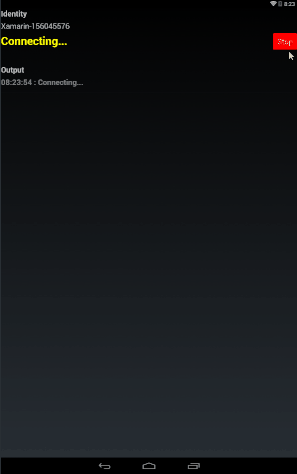

## Realtime.Messaging.Xamarin

Realtime messaging SDK for Xamarin. The Messaging Service is a highly-scalable pub/sub message broker. Using your favorite programming language you'll be able to broadcast messages to millions of users, reliably and securely. It's all in the cloud so you don't need to manage servers.

### Implementation

This repository includes both the SDK and a sample application using Xamarin Forms for iOS and Android. This implementation uses OKHTTP.ws and SocketRocket Binding Libraries for websocket support.

https://github.com/mattleibow/square-bindings


### Installation

#### NUGET
Since the Websocket is implemented unique for each platform, each project must reference this nuget package.

#### IOS

For IOS 9, you will need to include a key to your **PList.info**. This may be done in notepad or any text editor.

> App Transport Security has blocked a cleartext HTTP (http://) resource load since it is insecure. Temporary exceptions can be configured via your app's Info.plist file." (See also Apple's corresponding tech note.). 
One way to workaround: Add an NSAppTransportSecurity key to the Info.plist. Under that key, add a dictionary that contains a single NSAppTransportSecurity key set to true: 


`````
<key>NSAppTransportSecurity</key><dict><key>NSAllowsArbitraryLoads</key> <true/></dict>.
`````

#### Android

I had an issue where OKHttp was referenced twice in my android project (From modernhttpclient and OKHttp.ws). This causes an error when building as it tried to include the java dependencies twice. The solution was to manually remove the reference (not the package, just the reference) from the Android project.


### Sample

Demo / Sample of the http://realtime.co PCL websocket messaging framework plugin using Xamarin Forms.



#### Usage

- Add your application keys to MainView.cs
- Run the application

### Questions

Post onto the Github issue system or contact me via my [blog](http://nicholasventimiglia.com)
